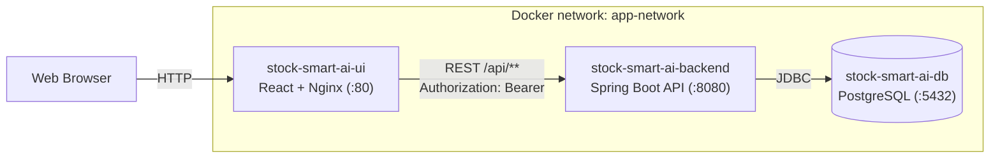
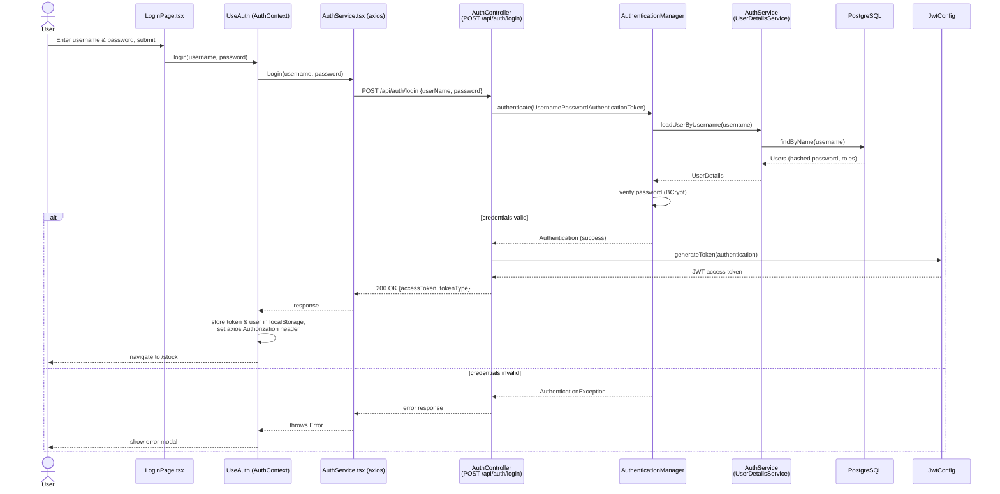

<meta name="description" content="Stock Smart AI">
<meta name="keywords" content="stock, smart, ai, agent, mcp">


# Stock Smart AI

### Overview
Stock Smart AI is an innovative inventory stock tracker designed to revolutionize the way businesses manage their inventory. Leveraging advanced AI services and intelligent agents, this system provides unparalleled support and data analysis capabilities. It employs AI to assist users in real-time, offering guidance and insights to optimize stock levels and predict future demands accurately. Additionally, Stock Smart AI communicates interactively with users, explaining its functionalities and providing updates on inventory status through a user-friendly application interface. This integration of AI not only enhances operational efficiency but also ensures that users can make informed decisions based on reliable, data-driven insights.

### Download and Install DBeaver Community Version
Allows to visualize the tables

``` 
https://dbeaver.io/
```

### Download the application
```
git clone https://github.com/fabandalm/stock-smart-ai.git
```

### Start up the application
```
docker-compose up -d
```

#### Only for the first time - copy and run data script file
``` 
docker cp database/seed.sql stock-smart-ai-db:/stock-smart-ai-db/data/seed.sql
```

```
docker exec -it stock-smart-ai-db psql -U postgres -d postgres -f /stock-smart-ai-db/data/seed.sql
```

### Shut down the application
```
docker-compose down
```

### Running Tests

#### Backend Tests
```bash
cd backend
./gradlew test
```

#### Frontend Tests
```bash
cd frontend
npm install  # First time only
npm test
```

For CI environments, use:
```bash
CI=true npm test
```

### Architecture

The application is composed of three containers wired together by `docker-compose.yaml`: a React frontend served by Nginx, a Spring Boot REST API, and a PostgreSQL database.



- **Frontend (`/frontend`)** – React + TypeScript SPA that renders the dashboard, stock/supplier/category pages, and authenticates via `AuthContext`/`UseAuth`.
- **Backend (`/backend`)** – Spring Boot API exposing `/api/**` endpoints, secured with stateless JWT authentication (`JWTAuthFilter`, `JwtConfig`, `SecurityConfig`).
- **Database** – PostgreSQL, seeded via `database/seed.sql`.

### Login Sequence

Authentication is username/password based. The backend validates credentials with Spring Security's `AuthenticationManager`, and on success issues a JWT that the frontend stores and attaches to subsequent requests.


